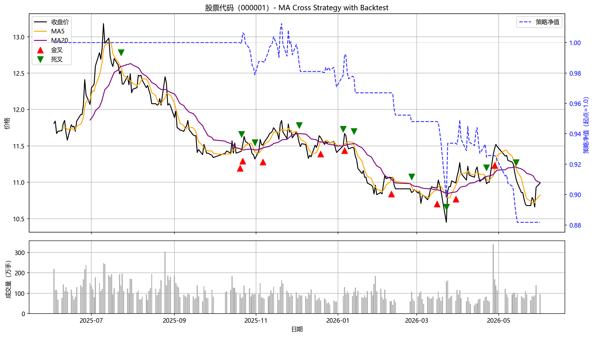

# Quant Start: A-Share MA Cross Strategy Demo

> A Python demo project for Chinese A-share daily data pipeline with Moving Average (MA) cross signal detection. Built with a clean modular architecture for future extensibility.

## 📊 Effect Preview



The chart above shows Pingan Bank (000001) over the past year:
- **Black line**: closing price
- **Orange line**: MA5 (5-day moving average)
- **Purple line**: MA20 (20-day moving average)
- **Red triangles ▲**: golden cross signals (potential buy)
- **Green triangles ▼**: death cross signals (potential sell)
- **Bottom subplot**: trading volume in 万手 (10K-shares)

## 📁 Project Structure
quant_start/
├── main.py                  # Entry point: orchestrates the pipeline
├── data_loader.py           # Data layer: fetch from akshare + local CSV cache
├── signals.py               # Signal layer: MA computation + cross detection
├── visualization.py         # Plot layer: dual-subplot chart generation
├── requirements.txt         # Project dependencies
├── images/                  # Output charts (committed for README display)
│   └── ma_cross_demo.png
├── daily_data_cache/        # Local CSV cache (gitignored)
├── .gitignore
└── README.md

The project follows the **Single Responsibility Principle** — each module does one thing:
- Want to switch data source (akshare → Wind)? Only touch `data_loader.py`.
- Want to add new indicators (MACD, RSI)? Only touch `signals.py`.
- Want to redesign the chart? Only touch `visualization.py`.

## 🛠️ Requirements

- Python 3.10+
- See `requirements.txt` for package dependencies

## 🚀 Quick Start

Clone the repository:
```bash
git clone git@github.com:QJ-SB/quant_start.git
cd quant_start
```

Set up virtual environment and install dependencies:
```bash
python -m venv .venv
.\.venv\Scripts\activate          # Windows PowerShell
pip install -r requirements.txt
```

Run the demo:
```bash
python main.py
```

The pipeline will:
1. Load past year's daily data of stock `000001` (Pingan Bank) — from local CSV if cached, otherwise fetch from akshare
2. Compute MA5 and MA20 moving averages
3. Detect golden cross and death cross signals
4. Print signal dates with closing prices to the terminal
5. Generate a dual-subplot chart at `images/ma_cross_demo.png` (price+MA on top, volume below)

### Module Self-Tests

Each module can be run independently for testing:
```bash
python data_loader.py      # Tests data fetching/caching
python signals.py          # Tests MA + cross detection
python visualization.py    # Tests chart generation
```

## 🧠 Core Logic

### Moving Average Cross Strategy

A **golden cross** occurs when the short-term MA crosses **above** the long-term MA — traditionally interpreted as a bullish signal. A **death cross** is the opposite.

The key insight: **a cross is a state change, not a state**. The detection compares today's relationship between MA5 and MA20 with yesterday's:

```python
df["golden_cross"] = (
    (short_ma > long_ma) &
    (short_ma.shift(1) <= long_ma.shift(1))
)
```

### Local Cache Layer

To decouple development from network dependency (especially when working across borders), data fetching is wrapped in a cache layer:
- First run: fetches from akshare, saves to local CSV
- Subsequent runs: reads directly from CSV (no network needed)
- Use `force_refresh=True` to bypass cache

### Volume Subplot

Price-only signals are noisy. Adding volume as a secondary indicator helps validate moves:
- **Volume rising with price** → likely a real trend
- **Volume falling while price rises** → likely a fake breakout

The volume subplot uses `plt.subplots()` with `sharex=True` to keep both panels synchronized.

## ⚠️ Known Limitations

- **MA cross signals are weak indicators**. They generate frequent false signals in sideways markets and lag in trending markets. This project is for learning purposes — **do not use it for actual trading**.
- The data source `akshare` is suitable for personal research only. Production-grade quantitative systems use Wind, level-2 feeds, or proprietary data sources.
- Currently only supports a single stock at a time. Multi-stock support, backtesting, and risk metrics (Sharpe, max drawdown, win rate) are planned for future versions.

## 📝 License

MIT License (planned)

---

*This project is part of my learning journey into quantitative finance. Built in 2026.*